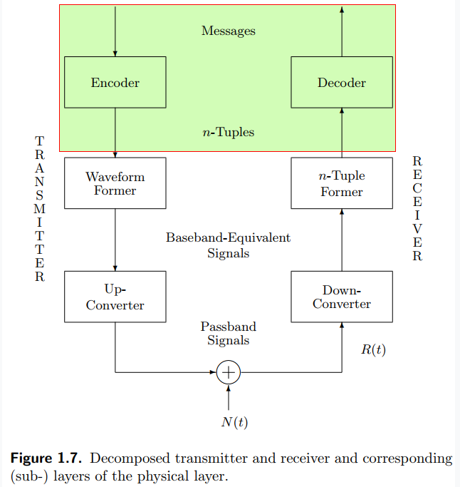
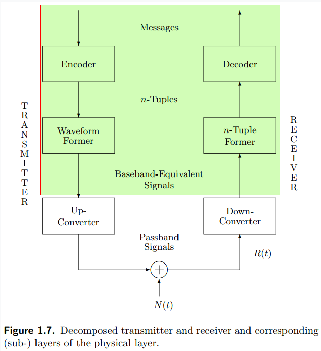
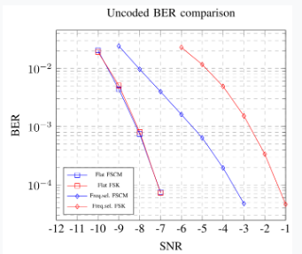
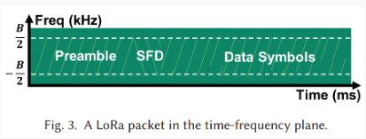
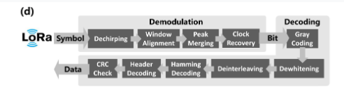

# Comunicaciones Digitales - Trabajo Integrador

Trabajo Integrador de Comunicaciones Digitales - UNC - Facultad de Ciencias Exactas Fisica y Naturales
Alumnos:

1. Krede, Julian
2. Piñera, Nicolas

---

## Primera Parte: Diseño del Codificador-Decodificador

Utilizando una Jupyter Notebook, generamos un array binario con distribucion uniforme el cual seran nuestros bits a transmitir, tiene una longitud multiplo del **SF (Spreading Factor)**

Posteriormente implementamos el **codificador** que se muestra en la ecuacion (1) propuesta por Vangelista, donde se agrupa dentro de nuestro vector binario, grupos de bits cuyo tamaño es de **SF (Spreading Factor)**, luego se utiliza el polinomio de numeracion tomando cada bit y multiplicandolo por $2^ĥ$ siendo $h$ la posicion del bit.

Nuestro **decodificador** fue implementado realizando las sucesivas divisiones por 2 (base binaria), guardando el modulo/resto en un vector y por ultimo invirtiendo dicho vector.

Se realizo un ejemplo del funcionamiento de ambas partes, su comparacion y el calculo del **BER** que se entiende como la relacion entre la cantidad de bits errados sobre la cantidad de bits enviados. En esta etapa al no estar incluido el ruido, este valor fue igual a $0%$

---

## Segunda Parte: Diseño del Waveform Former - n-Tuple former

En nuestra Jupyter Notebook, implementamos el **waveform former** y el **n-Tuple former** siguiendo el paper de Vangelista. El waveform former genera la señal chirp para cada símbolo usando la ecuación (2), vectorizando la operación con Numpy para máxima eficiencia. El n-Tuple former realiza la demodulación multiplicando la señal recibida por un downchirp y aplicando la FFT, detectando el símbolo como el índice del máximo de la FFT. Calculamos la tasa de error de símbolo (SER) y validamos que en canal ideal se obtiene SER=0, confirmando la correcta implementación. Todo el procesamiento se realizó evitando listas y utilizando operaciones vectorizadas.

**Test:** Si el Waveform Former y el n-Tuple Former se encuentran bien diseñados, bajo esta condición de funcionamiento debe dar un SER=0, cualquiera sea la cantidad de bits generados.

**Nota:** Para optimizar el rendimiento de las etapas a diseñar utilizar los recursos brindados por la biblioteca numpy, evitando utilizar listas.

---

## Tercera Parte: Implementación del ruido del Canal

En la notebook, agregamos ruido AWGN (ruido aditivo blanco gaussiano) a la señal transmitida. El ruido se genera con media cero y varianza calculada a partir del SNR deseado en dB, usando la relación:
$$
\sigma^2 = \frac{1}{2 \cdot SNR_\text{lineal}}
$$
donde $SNR_\text{lineal} = 10^{SNR_{dB}/10}$. Simulamos la transmisión para distintos valores de SNR y graficamos las curvas de BER y SER para el sistema LoRa bajo canal plano (flat), validando la robustez del sistema. Todo el procesamiento se realizó con Numpy y operaciones vectorizadas.

**Nota:** Para optimizar el rendimiento de las etapas a diseñar utilizar los recursos brindados por la biblioteca numpy, evitando utilizar listas.

---

## Cuarta Parte: Implementación de un canal selectivo en frecuencia

Implementamos el canal selectivo en frecuencia como:
$$
h(nT) = \sqrt{0.8}\,\delta(nT) + \sqrt{0.2}\,\delta(nT-T)
$$
En la notebook, aplicamos este canal mediante convolución discreta sobre la señal transmitida antes de sumar el ruido. Luego, repetimos la demodulación y el cálculo de BER/SER, obteniendo las curvas correspondientes para el escenario selectivo en frecuencia. Todo el procesamiento se realizó de forma vectorizada.

**Nota:** Para optimizar el rendimiento de las etapas a diseñar utilizar los recursos brindados por la biblioteca numpy, evitando utilizar listas.

---

## Quinta Parte: Implementación del sistema LoRa en el SDR

A partir del Paper de referencia **"From Demodulation to Decoding: Toward Complete LoRa PHY Understanding and Implementation"** implementar la transmisión de tramas LoRa en el transmisor

y las etapas de Dechirping, Window Alignment, Peak Merging y clock Recovery en el receptor

Probar el sistema futilizando en los SDRs para el envío de mensajes cortos.

Utilizar ademas una celda de la Jupyter Notebook para desarrollar la matematica, conceptualizar la teoría y/o lógica utilizada en el algoritmo propuesto por ud.

**Nota:** Para optimizar el rendimiento de las etapas a diseñar utilizar los recursos brindados por la biblioteca numpy, evitando utilizar listas.

---

## Información relevante y referencias

- **Codificador/Decodificador:** Implementados según la ecuación (1) del paper, usando operaciones vectorizadas para conversión bits ↔ símbolos.
- **Waveform Former/n-Tuple Former:** Basados en la ecuación (2) y la sección III del paper de Vangelista, con generación y demodulación chirp usando Numpy y FFT.
- **Canal AWGN:** Ruido generado con distribución normal compleja, varianza ajustada por SNR.
- **Canal selectivo:** Implementado por convolución discreta con la respuesta al impulso propuesta.
- **Curvas BER/SER:** Calculadas y graficadas para ambos escenarios de canal, validando la robustez del sistema LoRa.

### Ecuaciones clave

- **Codificación símbolo:** $s(nT_s) = \sum_{h=0}^{SF-1} w(nT_s)_h \cdot 2^h$
- **Waveform Former:** $c(nT_s + kT) = \frac{1}{\sqrt{2^{SF}}} e^{j2\pi \left[(s(nT_s) + k) \mod 2^{SF}\right] \frac{k}{2^{SF}}}$
- **Demodulación (n-Tuple Former):** Downchirp $\cdot$ FFT, símbolo estimado por el máximo de la FFT.
- **Canal selectivo:** $h(nT) = \sqrt{0.8}\,\delta(nT) + \sqrt{0.2}\,\delta(nT-T)$

### Referencias

- Vangelista, L. "Frequency Shift Chirp Modulation: The LoRa Modulation"
- Xu, Z., Tong, S., Xie, P., Wang, J. "From Demodulation to Decoding: Toward Complete LoRa PHY Understanding and Implementation"
- Apuntes y ejemplos de clase

---
